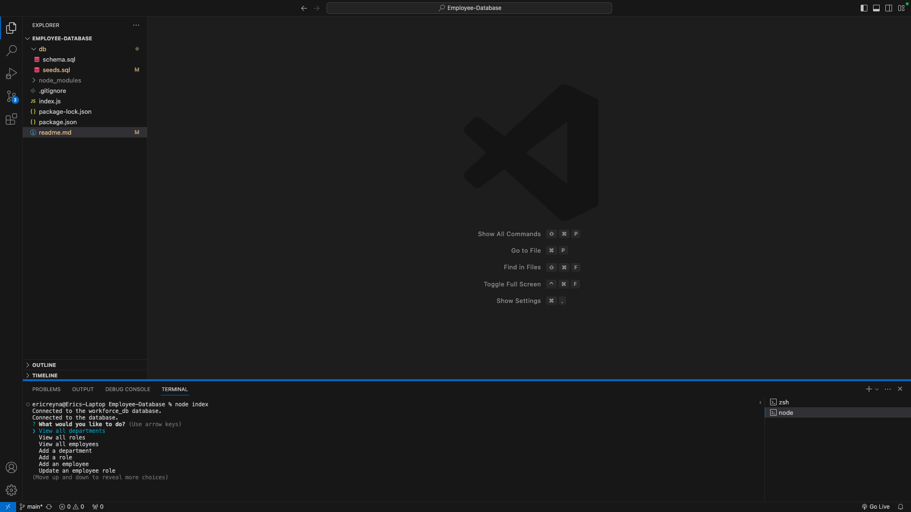
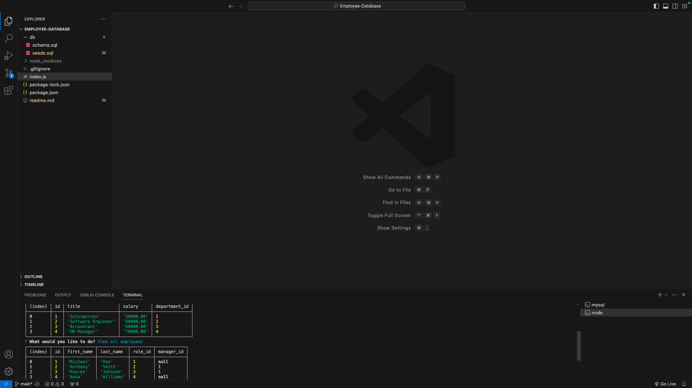

# Employee-DataBase

## License
  

  This project is licensed under the MIT license.
  
<a href= "https://choosealicense.com/licenses/mit/">link to MIT license</a>

## Description
To create an Employee-Database that labels Departments, roles, and employee names and id numbers. YOu can also add a department, roles and new employee.

## Table of Contents
- [License](#license)
- [Installation](#installation)
- [Usage](#usage)
- [Contributing](#contributing)
- [Tests](#tests)
- [Questions](#questions)

## Installation
I used inquirer v8.2.4 and MYSQL2 to make my project work.

## Usage
To copy path from index.js file and open into terminal. Once you confirm youre in the correct file, use the function node index.js to start application.

## Contributing
Eric Reyna

## Tests
Adding recording of a test run in my readme file.

## Questions
For additional questions, you can reach me through:
- GitHub: [Ereyna21](https://github.com/Ereyna21)
- Email: ereyna21075@gmail.com

Repository Link: https://github.com/Ereyna21/Employee-Database

Recording Link: https://drive.google.com/file/d/1xhpgQM_h_kvo3xxdLL469mxnyoLQyX9d/view

